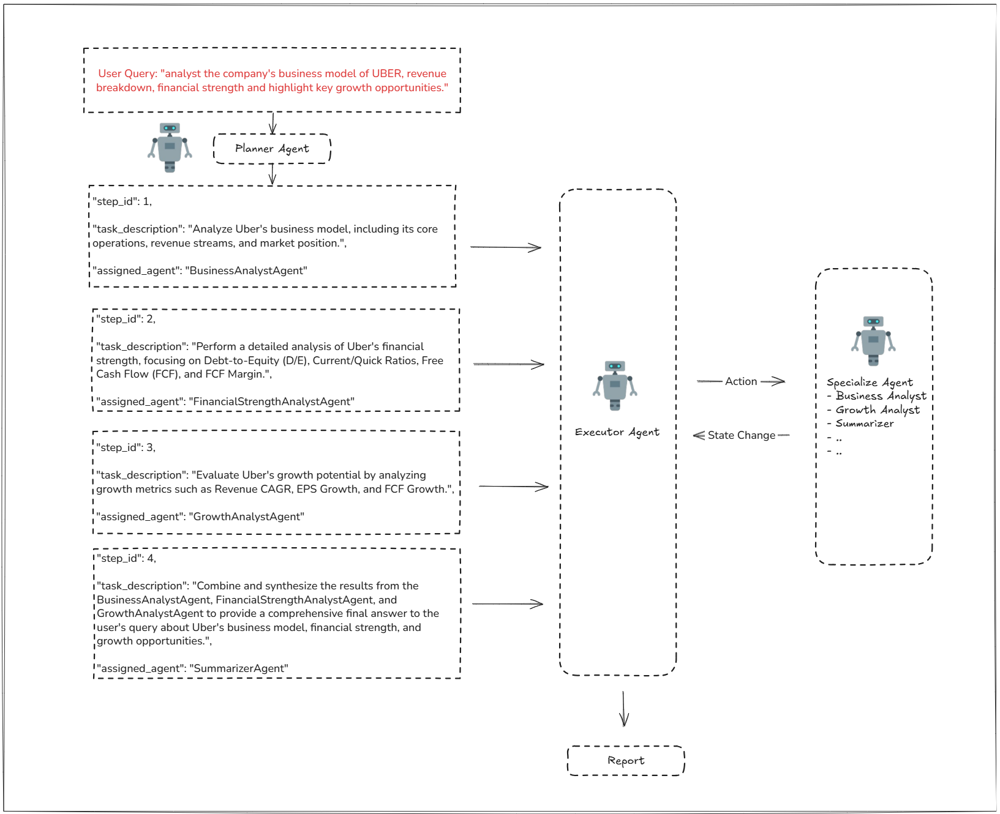
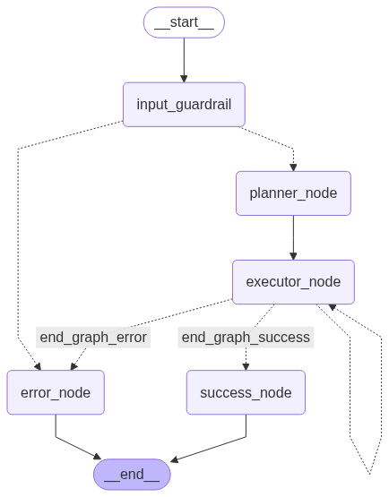

# Dean's Valuation Engine: AI-Powered Investment Analysis System
---

## Overview: Dean's Valuation Engine

Dean's Valuation Engine is an advanced AI-powered investment analysis system that delivers comprehensive company insights and market analysis in minutes, not days.

Built upon the renowned **Damodaran Valuation Framework**, it combines rigorous quantitative assessment with compelling business narratives. It doesn't just crunch numbers — it crafts the story behind them.

The name pays homage to Professor Aswath Damodaran, the "Dean of Valuation", reflecting the system's foundation in his esteemed methodologies and its commitment to excellence in financial analysis.

---

## Table of Contents

- [Features](#features)
- [Sample Analysis Output](#sample-analysis-output)
- [Key Technologies](#key-technologies)
- [Architecture & Technical Deep Dive](#architecture--technical-deep-dive)
- [Transparency & Responsibility](#transparency--responsibility)
- [Getting Started](#getting-started)
- [License](#license)

---

<a id="features"></a>
## Features
- **Symphony of Specialized Agents**: A coordinated team of AI analysts, each mastering specific domains (business models, financial health, market trends, growth analysis, competitive moats), collaborating to provide holistic investment insights.

- **Comprehensive Risk Analysis Framework**: Every specialized agent now includes systematic risk assessment, identifying key risks, evaluating impact and likelihood, and providing mitigation strategies.
- **Dynamic Analysis Plans**: Powered by LangGraph, the system intelligently adapts its analysis strategy for each unique company, ensuring relevant and thorough investigation.
- **Multi-Model AI Support**: Flexible AI provider integration through OpenRouter, supporting multiple models (GPT-4o, Claude, Mistral) with per-agent configuration.
- **Pinpoint Analysis Capabilities**:
    - **Business Model & Market Sizing**: Uncover company success DNA and true market potential with TAM/SAM/SOM analysis and revenue stream evaluation.
    - **Financial Strength Assessment**: Deep dive into financial statements to assess strength, stability, and future outlook using industry-specific benchmarks and key ratios.
    - **Growth Analysis**: Evaluate historical growth trends and future potential through CAGR, EPS growth, and reinvestment efficiency metrics.
    - **Competitive Moat Analysis**: Systematic assessment of economic moats using the five-moat framework (brand, network effects, switching costs, cost advantage, intangible assets).
    - **Insight Synthesis Engine**: Transforms raw data and individual findings into coherent, actionable investment intelligence.
- **Real-Time Web Intelligence**: Integrated web search (via Brave Search) ensures analysis is fueled by the latest information and market developments.
- **Rock-Solid & Type-Safe**: Built with Python 3.12+ and comprehensive type-hinting, ensuring robustness, maintainability, and reliability.
- **Detailed Execution Logging**: Transparent and detailed logging of every step in the analysis graph, perfect for understanding, debugging, and auditing.


---

<a id="sample-analysis-output"></a>
## 📝 Sample Analysis Output

Here's an example of a synthesized report generated by Dean's Valuation Engine for "Company X", combining business model insights, financial health assessment, and market trends.

<details>
<summary><strong>=======> 📊 Click to view the full analysis report for Company X <=======</strong></summary>

**query:** "analyze moat comparison of Uber and Lyft"

**report:** 
## Comprehensive Analysis of the Economic Moats of Uber and Lyft

### Identifying the Source of Competitive Advantage (Moat)

#### Uber
- **Brand Power:** Uber is a globally recognized brand, operating in over 70 countries with a significant presence in the ride-sharing and food delivery markets. Its brand recognition allows it to maintain a strong market position, especially in the U.S. where it holds a 72% market share in ride-sharing. However, the brand's ability to command premium pricing is limited due to intense competition from companies like Lyft and regional players such as Bolt and DiDi (Morningstar).
- **Network Effect:** Uber benefits significantly from network effects. As more drivers join the platform, it becomes more attractive to riders due to reduced wait times and increased availability. This two-sided network effect is a critical component of Uber's competitive advantage, making it difficult for new entrants to compete without a substantial initial user base (Morningstar).
- **High Switching Costs:** Switching costs for consumers are relatively low, as users can easily switch between Uber and its competitors like Lyft. However, for drivers, the switching cost is slightly higher due to the time and effort required to meet the requirements of different platforms. Nonetheless, this does not constitute a strong moat (Morningstar).
- **Cost Advantage:** Uber does not have a significant cost advantage over its competitors. The ride-sharing industry is characterized by thin margins and high operational costs. Uber's focus on expanding its services and investing in autonomous vehicles may provide future cost efficiencies, but currently, it does not operate at a structurally lower cost than its rivals (Morningstar).
- **Intangible Assets:** Uber holds some proprietary technology and data analytics capabilities that enhance its operational efficiency and user experience. However, these are not unique enough to create a substantial barrier for competitors (Morningstar).

#### Lyft
- **Brand Power:** Lyft has cultivated a strong brand identity centered around community and inclusivity, distinguishing itself from competitors like Uber. This brand positioning has helped Lyft attract a loyal customer base, particularly those who value a friendly and approachable service. However, the brand power is not as strong as Uber's, which dominates the market with a larger share and more extensive service offerings (Morningstar).
- **Network Effect:** Lyft benefits from a network effect, as the value of its ride-sharing platform increases with more users and drivers. This effect is crucial in the ride-sharing industry, where a larger network can lead to shorter wait times and more competitive pricing. However, Uber's larger network presents a significant challenge, limiting Lyft's ability to leverage this effect fully (Morningstar).
- **High Switching Costs:** Switching costs in the ride-sharing industry are relatively low, as customers can easily switch between platforms like Lyft and Uber. While Lyft offers some unique features and a strong community focus, these are not substantial enough to create high switching costs for most users (Morningstar).
- **Cost Advantage:** Lyft does not have a significant cost advantage over its competitors. The company faces similar operational costs and pricing pressures as Uber, which can cross-subsidize its services with other business segments like Uber Eats. This lack of cost advantage limits Lyft's ability to compete on price (Morningstar).
- **Intangible Assets:** Lyft holds some intangible assets, such as proprietary algorithms and mapping data, which contribute to its service efficiency and reliability. However, these assets are not unique enough to create a substantial moat, as competitors have similar technological capabilities (Morningstar).

### Market Share and Competitive Positioning

#### Uber
- **Market Share Analysis:** Uber is a dominant player in the U.S. ride-sharing market with a 72% market share. Globally, it holds a 25% share in the ride-hailing and taxi market. Over the past few years, Uber has maintained its leadership position, although growth has been challenged by regional competitors (Morningstar).
- **Profitability of Market Leadership:** Uber's market share growth has been accompanied by improving profitability. In Q1 2025, Uber reported a revenue of $11.53 billion with an operating income of $1.2 billion, indicating strong operational performance. However, the ride-sharing segment's profitability remains pressured by competitive pricing and high operational costs (Morningstar).

#### Lyft
- **Market Share Analysis:** Lyft holds approximately 24-32% of the U.S. ride-sharing market, making it a significant player but not the market leader. Uber maintains a dominant position with a larger market share. Lyft's market share has remained relatively stable over the past few years, with slight fluctuations (Morningstar).
- **Profitability of Market Leadership:** Lyft's profitability remains a challenge, as the company continues to face pricing pressures and high operational costs. While Lyft has achieved revenue growth, its margins are not as strong as Uber's, which benefits from economies of scale and diversified revenue streams. Lyft's market share growth has not been accompanied by significant margin improvements, indicating a competitive environment where profitability is fragile (Morningstar).

### Industry Structure and Competitive Landscape

- **Industry Type:** The ride-sharing industry is characterized by a "winner-takes-most" structure, where a few dominant players capture the majority of the market share and profits. Uber and Lyft are the primary competitors, with Uber holding a more substantial lead (Morningstar).
- **Market Concentration and Competition:** The market is highly concentrated, with Uber and Lyft being the main players. This concentration creates intense competition, particularly in pricing and service differentiation. New entrants face significant challenges in gaining market share due to the established networks of these companies (Morningstar).
- **Barriers to Entry:** Barriers to entry in the ride-sharing industry include the need for a large network of drivers and users, significant capital investment, and regulatory compliance. While these barriers protect existing players like Lyft, they are not insurmountable, especially for well-funded new entrants (Morningstar).

### Overall Moat Assessment and Outlook

- **Moat Verdict:** Both Uber and Lyft possess a narrow economic moat primarily due to network effects. Uber's larger scale and global presence give it a stronger market position compared to Lyft. However, both companies face challenges in translating their moats into sustainable profitability (Morningstar).
- **Moat Source Identification:** Network Effect is the primary moat for both companies (Morningstar).
- **Synthesis of Moat and Market Position:** Uber's network effects and brand recognition support its market leadership in the ride-sharing industry. These structural advantages contribute to its significant market share and improving profitability, although the competitive environment remains challenging. Lyft's structural advantages are limited, and its market position is vulnerable to competitive pressures (Morningstar).
- **Long-Term Profitability Outlook:** The long-term profitability of both companies depends on their ability to leverage network effects while managing operational costs and regulatory challenges. Uber's larger scale provides a better outlook for durable profitability compared to Lyft (Morningstar).

### Risk Analysis

- **Competitive and Industry Risks:** Both companies face risks from disruptive technologies (e.g., autonomous vehicles), regulatory shifts, and aggressive new entrants (Morningstar).
- **Likelihood and Impact of Moat Deterioration:** The likelihood of moat deterioration is moderate, with potential impacts including reduced market share and profitability (Morningstar).
- **Analyst Commentary:** To defend their competitive advantage, both Uber and Lyft should focus on enhancing customer loyalty, expanding service offerings, and navigating regulatory landscapes effectively (Morningstar).

### Summary

- **Uber and Lyft both possess network effects as their primary moat, with Uber having a stronger position due to its larger scale (Morningstar).**
- **Neither company has a significant cost advantage or high switching costs, making their moats relatively narrow (Morningstar).**
- **Uber's larger market share and global presence provide it with a stronger competitive position compared to Lyft (Morningstar).**
- **The ride-sharing industry is characterized by a "winner-takes-most" dynamic, with Uber and Lyft facing moderate barriers to entry (Morningstar).**
- **Both companies face risks from disruptive technologies, regulatory shifts, and new entrants, requiring strategic actions to defend their moats (Morningstar).**

### References

- Morningstar
- Statista
- Forbes
- Investopedia
- LinkedIn
- CNBC
- Brand24
- The Motley Fool
- DriveMond
</details>

<a id="key-technologies"></a>
## Key Technologies

   

- **Multi-Provider AI Models** – OpenRouter integration supporting GPT-4o, Claude, Mistral, and other leading models
- **LangGraph** – dynamic stateful workflow engine
- **LangChain** – agent and prompt framework
- **Brave Search API** – web search capabilities
- **Python 3.12+** – modern Python with comprehensive type-hinting

---

<a id="architecture--technical-deep-dive"></a>
## 🏗️ Architecture & Technical Deep Dive

Dean's Valuation Engine isn't just a program; it's a sophisticated ecosystem of intelligent agents working in concert, orchestrated by a dynamic graph-based workflow.

---

<details>
<summary><strong>🔬 Click for a detailed file-by-file breakdown</strong></summary>

Here's a glimpse into its inner workings:

```
dean_valuation_engine/
├── src/
│   ├── agents/                 # 🧠 The Brains: Specialized AI Agents
│   │   ├── planner_agent.py    # 🗺️ The Master Orchestrator
│   │   ├── specialize_agent/   # 🕵️‍♂️ Domain Experts
│   │   ├── other_agent/        # 🧩 Utility Agents
│   │   ├── registry.py         # 📚 Agent Directory
│   │   └── constant.py         # ⚙️ Agent Config
│   ├── graph_nodes/            # 🔗 The Workflow Engine
│   │   ├── graph_builder.py    # 🏗️ The Architect
│   │   ├── graph_state.py      # 💾 Shared Memory
│   │   └── nodes/              # 🧩 Action Blocks
│   ├── tools/                  # 🛠️ The Toolkit
│   │   ├── search_tools.py     # 🌐 Web Intelligence
│   │   └── web_loader_tools.py # 📄 Content Fetchers
│   ├── utils/                  # 🔧 Utility Belt
│   │   ├── config_manager.py   # 🔑 Secrets & Settings
│   │   ├── graph_logger.py     # 📊 Execution Insights
│   │   └── logger.py           # 📝 General Scribe
├── pyproject.toml              # 📦 Dependencies
├── main.py                     # 🚀 Entry Point
└── README.md                   # 🕮 You are here!
```

---

### Core Principles

1️⃣ **Agent Specialization**  
At the heart of Dean's are highly specialized agents. The `PlannerAgent` acts as the conductor, interpreting user requests and devising a strategic plan. It then delegates tasks to `SpecializeAgent`s, such as:
- **BusinessModelAnalyst:** Dissects business models, revenue streams, and market positioning.
- **FinancialStrengthAnalyst:** Scrutinizes financial health, ratios, and stability.

2️⃣ **Dynamic Workflow Orchestration (LangGraph)**  
Forget static scripts! Dean's uses `LangGraph` to build and execute dynamic workflows.
- The `GraphBuilder` constructs a stateful graph where each `Node` represents a specific action (e.g., run an agent, search the web, process data).
- `GraphState` ensures information flows smoothly between nodes, allowing for complex, multi-step reasoning.
- This graph-based approach allows for conditional logic, retries, and parallel execution, making the analysis robust and adaptable.

3️⃣ **Data-Driven Insights (Tools)**  
Agents are empowered by a suite of `Tools`:
- `SearchTools` (leveraging Brave Search API) provide access to real-time web data, ensuring analyses are current and comprehensive.
- `WebLoaderTools` fetch and prepare online content for agent consumption.

4️⃣ **Robust Foundation (Utils & Guardrails)**  
- `ConfigManager` securely handles sensitive information like API keys.
- Comprehensive logging (`GraphLogger`, `Logger`) provides transparency and aids in debugging.
- The `Guardrails` system aims to ensure ethical, unbiased, and responsible AI outputs.

> This architecture allows Dean's to tackle complex analytical challenges with a level of depth and dynamism previously unattainable. It's not just about processing data; it's about generating genuine understanding.

---

## 🔬 Technical Deep Dive: How the Magic Happens 🛠️

Dean's's power stems from a carefully crafted architecture, blending specialized AI agents with a dynamic workflow engine. (Refer to the [System Architecture](#system-architecture) diagram for a visual map!)



### The Agentic Powerhouse

The core of Dean's is its multi-agent system, primarily managed within the `src/agents/` directory:
- **`PlannerAgent` (The Conductor)**: This crucial agent, located in `planner_agent.py`, receives the user's request. It then formulates a strategic plan, deciding which specialized agents are needed and in what order they should run. Think of it as the project manager for the AI team.
- **`SpecializeAgent`s (The Experts)**: Housed in `src/agents/specialize_agent/`, these are the domain gurus. Examples include:
    - *BusinessModelAnalyst*: Focuses on understanding a company's operational strategy, revenue generation, and market positioning.
    - *FinancialStrengthAnalyst*: Dives into financial statements, calculating key ratios and assessing overall fiscal health.
    Each agent leverages LangChain for its core logic, equipped with custom-engineered prompts tailored for its specific analytical tasks. The `agents/registry.py` helps in managing and accessing these specialized agents.

### Dynamic Workflow Orchestration with LangGraph

Static, predefined workflows are too limiting for complex analysis. That's where LangGraph, managed in `src/graph_nodes/`, shines:
- **`GraphBuilder` (`graph_builder.py`)**: This module is responsible for constructing the actual execution graph. Based on the `PlannerAgent`'s strategy, it dynamically assembles a series of `Nodes` (from `src/graph_nodes/nodes/`).
- **`GraphState` (`graph_state.py`)**: This defines the shared "memory" or state that is passed between nodes in the graph. It allows information, partial results, and context to flow seamlessly through the analysis pipeline.
- **Nodes**: Each node in the graph represents a specific task – invoking an agent, calling a tool (like web search), processing data, or making a decision. This modularity allows for incredible flexibility and the ability to create sophisticated, multi-step reasoning chains.

### Empowering Tools & Utilities

- **Real-Time Data Acquisition (`src/tools/`)**:
    - `search_tools.py`: Integrates with Brave Search API, providing agents with the ability to perform real-time web searches for the most up-to-date information.
    - `web_loader_tools.py`: Fetches and preprocesses content from URLs, making it ready for agent analysis.
- **Robust Foundation (`src/utils/`)**:
    - `config_manager.py`: Securely manages API keys (OpenAI, Brave) and other configurations.
    - `logger.py` & `graph_logger.py`: Provide comprehensive logging. `graph_logger.py` is particularly vital, offering detailed insights into the execution of each node and the overall state of the LangGraph workflow, which is invaluable for debugging and understanding the system's behavior (this logs to `graph_execution_details.log`).

### Key Technologies Fueling the Robot

- **🧠 OpenAI (GPT models)**: The powerhouse behind the agents' reasoning, understanding, and generation capabilities.
- **🔗 LangChain**: The foundational framework for building agents, managing prompts, and structuring interactions with LLMs.
- **📈 LangGraph**: The engine for orchestrating the complex, stateful, multi-agent workflows.
- **🔒 Python 3.10+ with Full Type Hinting**: Ensures code clarity, robustness, and easier maintenance.
- **🛡️ spaCy**: Utilized for NLP tasks, potentially within the `guardrails` system for content analysis or PII detection.


---

</details>

<a id="transparency--responsibility"></a>
## 🛡️ Transparency & Responsibility

To ensure reliability, the engine is built with comprehensive logging. Every step of the analysis is tracked for full transparency.

<details>
<summary><strong>📋 Learn more about our logging implementation</strong></summary>

Understanding what the Dean's is doing and ensuring it operates responsibly are paramount.

---

### 📋 Comprehensive Logging

- **General System Logs (`src/utils/logger.py`)**: Captures broad operational information, errors, and system events.
- **Detailed Graph Execution Logs (`src/utils/graph_logger.py`)**: This is where the magic of the workflow becomes transparent! This module provides meticulous JSON Lines logs (`graph_execution_details.log`) for each graph run. It records:
    - A unique `run_id` for each analysis.
    - The state *before* and *after* each node in the LangGraph executes.
    - The outputs or errors generated by each node.
    - Graph start and end times.
    This granular logging is indispensable for debugging, performance analysis, and auditing the decision-making process of the AI.


</details>

## Development Practices

- **Type Safety**: Comprehensive type annotations throughout the codebase
- **Error Handling**: Robust error management for API calls and agent execution
- **Logging**: Detailed logging for debugging and monitoring
- **Modular Design**: Clean separation of concerns between agents, tools, and workflow

## Future Enhancements
- Specialized AI for Guidance Analysis and Narrative Generation (ongoing)
- Add guardrails for ethical and responsible AI use (e.g., bias mitigation, data privacy, content moderation) (ongoing)
- Integration with financial data APIs for direct access to company filings
- Expanded agent capabilities for technical analysis and competitive intelligence
- Interactive visualization of financial metrics and business insights
- Containerization for easy deployment and scaling


---

<a id="getting-started"></a>
## 🚀 Getting Started

### 🛠️ Prerequisites

- Python 3.10+
- OpenAI API key
- Brave Search API key for web search capabilities

### ⚙️ Installation

1️⃣ Ensure you have Python 3.10+ and [uv](https://github.com/astral-sh/uv) installed:
   ```bash
   pip install uv
   ```

2️⃣ Install project dependencies using `uv`:
   ```bash
   uv pip install -r pyproject.toml
   ```

3️⃣ (Recommended) Create and activate a virtual environment:
   ```bash
   uv venv .venv
   source .venv/bin/activate
   uv pip install -r pyproject.toml
   ```


---

<a id="license"></a>
## 📄 License

This project is licensed under the MIT License - see the LICENSE file for details.

---

*Developed by Pawarison Tanyu - A demonstration of advanced AI system design, LLM orchestration, and financial analysis capabilities.*